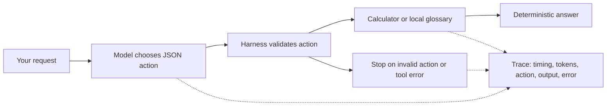
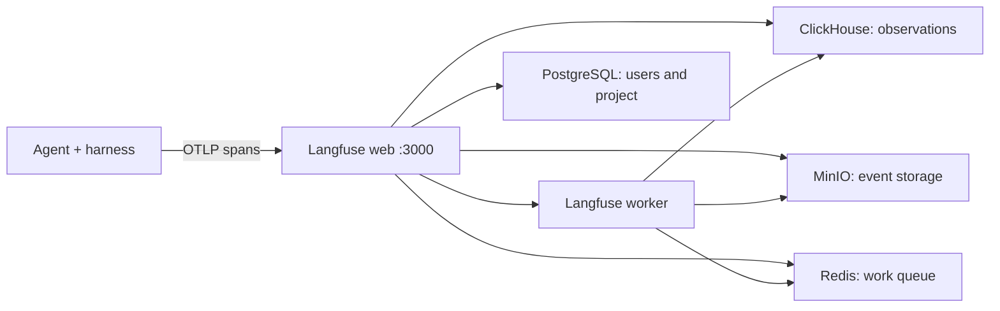

# Micro Agent Lab

A local learning demo using an existing pretrained Qwen2.5 0.5B model (~398 MB), Ollama, and a Python standard-library harness with a self-hosted Langfuse dashboard. Everything runs in Docker; no API key or cloud inference. The first start downloads container images and model weights. Later inference is local.

## Start

```sh
python3 scripts/init_env.py
python3 scripts/setup_identity.py
docker compose up --build -d
```

Open http://localhost:8080. First startup may take several minutes while the `setup` service downloads the model. Check progress with `docker compose logs -f setup`. The UI starts after that succeeds and Langfuse becomes healthy. Langfuse may need several minutes for its first database migrations.

CPU inference works on Mac, Windows, and Linux with Docker Compose. Allocate at least 8 GB RAM to Docker for the model plus the Langfuse stack. The **model download** is under 1 GB; container images, runtime RAM, context cache, and Docker disk usage are separate and can exceed 1 GB. On a Mac, this container uses CPU rather than Metal GPU acceleration.

## Understand the flow



1. Try **Calculate**. Inspect the model's raw JSON and token usage.
2. Try **Learn observability**. The model chooses a glossary lookup.
3. Select **Inject forbidden tool**. The harness rejects an injected `shell` action before execution.
4. Select **Inject tool failure**. Observe an explicit error trace.
5. Run **4 evaluations**. They check both tool choice and exact tool result. A failure is visible rather than disguised by a fallback.

This is intentionally a one-action agent: one model call, at most one tool, then return. It teaches the same harness boundary as a larger loop without retries or hidden automation. `finish` returns a direct model answer; calculator and glossary answers are grounded in tool results and rendered by Python. Fault injection changes the action/result after inference; it is labeled in the trace and does not claim the model generated the fault. Traces show model output, not hidden chain of thought.

Tiny models can choose the wrong tool or expression. Structured JSON guarantees a shape, not correctness. The calculator uses an AST allowlist, no `eval`, no shell, and bounded expressions/results. The glossary has only three entries. Requests are limited to 1000 characters, one concurrent run, 180 output tokens, 2048 context tokens, one tool, and a 90-second model HTTP timeout. There is no network, filesystem, or arbitrary code tool.

## Where to learn and modify

- `app/agent.py`: prompt, JSON schema, tools, budgets, spans, and evaluation cases.
- `app/server.py`: HTTP API and concurrency gate.
- `app/telemetry.py`: Langfuse OTLP payload, parent relationships, token usage, and export handling.
- `app/index.html`: trace explorer and fault controls.
- `compose.yaml`: model, one-shot download, app, and volumes.

The app records readable JSON locally and exports the same spans to Langfuse using OTLP/HTTP JSON. Spans share a run ID and include duration, tool arguments/results, model output, and token counts. `traces.jsonl` persists in the `traces` Docker volume; recent runs appear in the UI. Export it with:

```sh
docker compose exec -T demo cat /data/traces.jsonl > traces.jsonl
```

Trace storage grows with usage and includes your prompts. This demo is bound to localhost and is for local learning.

## API and checks

```sh
curl http://localhost:8080/api/health
curl -H "Authorization: Bearer $MICRO_TOKEN" -H 'Content-Type: application/json' -d '{"prompt":"What is 7 * 8?"}' http://localhost:8080/api/run
curl -H "Authorization: Bearer $MICRO_TOKEN" -H 'Content-Type: application/json' -d '{}' http://localhost:8080/api/evaluate
docker compose exec -T -e AUTH_ENABLED=false -e OPA_URL= demo python -m unittest discover -s tests -v
```

Protected API examples require a Keycloak access token in `MICRO_TOKEN`; use browser sign-in for the walkthrough.

`/api/health` reports the actual installed model size and checks it is below 1,000,000,000 bytes. Unit tests use injected model responses to check the harness independently; the UI evaluation uses real inference.

Stop: `docker compose down`. Restart: `docker compose up -d`. Delete model and trace volumes only when wanted: `docker compose down -v`.

## Sources

- Model and size: https://ollama.com/library/qwen2.5/tags
- Structured outputs: https://github.com/ollama/ollama/blob/main/docs/capabilities/structured-outputs.mdx

## Langfuse walkthrough

Open http://localhost:3000 and sign in with `demo@micro.local`. Your generated password is the `LANGFUSE_INIT_USER_PASSWORD` value in the local `.env` file. The **Micro Agent Demo** project and API keys are created automatically on first startup. No cloud account is needed.

1. Open http://localhost:8080 and run **Calculate**.
2. Click **Inspect this run in Langfuse**, or open **Micro Agent Demo → Tracing** in Langfuse.
3. Expand `agent.run`. Its children show the model generation, harness validation, calculator call, and answer.
4. Select `model.choose_action` to inspect the system/user messages, output JSON, model parameters, and input/output token counts.
5. Run **Inject forbidden tool**. The root and error observation are marked ERROR. Fault metadata lets you distinguish injected failures.
6. Run the four evaluations to create four additional traces; pass/fail results are shown in the demo UI. These are deterministic local checks, not a Langfuse LLM judge.



Each run uses the same trace ID in the local viewer and Langfuse. Export happens after the run completes, using recorded start offsets and durations rather than export time. Generations have model and token fields; validation uses the guardrail type, tool calls use the tool type. Root and child observations share fault/run/status metadata. An export failure is displayed separately and does not change the agent outcome. The exporter has a five-second timeout and does not retry or batch: the implementation is deliberately small for learning. Ingestion acceptance is reported as `accepted`; storage visibility is asynchronous.

All published ports are bound to localhost. Database, Redis, ClickHouse, and worker ports stay inside the Docker network. Langfuse usage telemetry is disabled. Prompts and results are stored in your local Docker volumes. `.env` is generated once, excluded from Git and the Docker build context, and holds the local login and service secrets. Keep it with the volumes: changing initialization variables does not rotate an existing user's password or project keys.

The model remains 397.8 MB. Langfuse brings additional containers, disk usage, and memory consumption. Its web/worker use the official v4 image tag, so later pulls may update within that major release.

Check startup: `docker compose ps` and `docker compose logs --tail 50 langfuse-web langfuse-worker`.

Integration reference: https://langfuse.com/integrations/native/opentelemetry
Docker reference: https://github.com/langfuse/langfuse/blob/main/docker-compose.yml

## Agents and human approval governance

The governed workflow is above the original lab at http://localhost:8080. All agents share the same 397.8 MB model; agents are server-defined roles, rather than additional model downloads.

| Agent | Tools | Delegation |
| --- | --- | --- |
| Coordinator | None | Dispatches to analyst, researcher, publisher, or expense agent |
| Analyst | Calculator, direct answer | None |
| Researcher | Local glossary, direct answer | None |
| Publisher | Simulated report publishing, direct answer | None |
| Expense agent | Synthetic expense reads and approval requests | None |

The coordinator dispatches the workflow selected by the user. Custom requests and the allowed-calculation scenario use real model inference for the specialist's action. Violation and approval scenarios use **explicit, labeled action fixtures** for repeatable demos. This is a bounded workflow with role-specific model prompts, not an autonomous multi-agent planner.

### Five-minute approval demo

1. Select **Report needs human approval**, then **Run governed workflow**.
2. Inspect the `approval_required` governance decision. The report has not been published.
3. In **Human approval queue**, review the exact tool and report text. Click **Approve this exact report**.
4. The report appears under **Simulated published reports**. The approval is single use; another approval attempt is rejected.
5. Create a second draft and reject it. No report is written.
6. Create another draft, change the tool budget or publishing permission, and save policy. Approving the old draft is blocked because the policy version changed. Create a fresh draft to review under the new policy.
7. Disable publishing and run the approval scenario again. Policy denies it before creating an approval request.
8. Try the role, budget, delegation, and synthetic-secret scenarios. Each explains its policy denial.

The publisher writes only to a local SQLite report table. It cannot send email, call a remote service, deploy code, or change your host. Human decisions create a separate Langfuse trace linked by `original_run_id` and `approval_id`. Specialist spans contain their model/tool/guardrail children. Governance outcomes, policy version, agent identity, and action details are visible in both viewers.

### Enforced rules

- Agent permissions and delegation boundaries are checked by Python, independently of model instructions.
- Each workflow has one specialist action; the configured tool budget can deny that action. The budget scenario simulates prior consumption explicitly.
- Publishing always requires human approval, and publishing can also be denied outright.
- Drafts store the exact action, its hash, original run, policy version, and a 15-minute expiration in the persistent SQLite database.
- Approval resolution uses a database transaction, rechecks current policy and remaining budget, and writes the report once. Rejection, expiration, tampering, replay, or policy-version change prevents publishing.
- `DEMO_SECRET=...` is a synthetic data-disclosure pattern. When enabled it is blocked before inference and before tools. The pattern is redacted from governance traces even if the blocking toggle is off. This is a teaching rule, not comprehensive secret detection.
- Policy changes are recorded in the audit trace stream.

The demo now requires Keycloak identities for API access. OPA enforces separate requester, approver, and administrator roles and prevents self-approval. LangGraph persists approval pauses. Langfuse has its own dashboard login. The stack remains a local development demo; production still requires HTTPS, hardened identity deployment, and tamper-resistant audit storage.

State survives container restarts in `governance.sqlite` inside the existing traces volume. Tests isolate state in temporary databases. API endpoints: `GET /api/governance`, `POST /api/team/run`, `POST /api/policy`, and `POST /api/approvals/resolve`. Write requests require JSON and reject browser cross-origin requests.

Implementation: `app/governance.py`. Run all harness/governance/export tests with `docker compose exec -T -e AUTH_ENABLED=false -e OPA_URL= demo python -m unittest discover -s tests -v`.

## Local security workshop

The UI includes eight exercises inspired by the Auxin Azure workshop: cited HR retrieval, synthetic expense reading/approval, unknown-report and amount-threshold denials, actual tool-budget exhaustion, and distinct task/compliance evaluation. See [workshop/README.md](workshop/README.md) for the four-session walkthrough and explicit differences from Azure. The expense agent uses the same persistent human approval queue; an approved expense produces only a local simulated action receipt.


## Authenticated governance: OPA + Keycloak + LangGraph

Open http://localhost:8080 and click **Sign in / switch account**. Keycloak runs at http://localhost:8180. Three distinct local identities are provisioned:

| Username | Password in `.env` | Authority |
| --- | --- | --- |
| requester | `REQUESTER_PASSWORD` | Start model/workshop workflows and request simulated writes |
| approver | `APPROVER_PASSWORD` | Approve or reject actions requested by another identity |
| administrator | `GOVERNANCE_ADMIN_PASSWORD` | Change governance policy |

The Keycloak console bootstrap account is `admin`, with `KEYCLOAK_ADMIN_PASSWORD`. It is separate from the application's `administrator` identity. The Langfuse login stays `demo@micro.local` with `LANGFUSE_INIT_USER_PASSWORD`.

### Demonstrate separation of duties

1. Sign in as **requester**, run **Approve a $250 synthetic expense**, and inspect the exact action. The approval workflow pauses and persists a LangGraph checkpoint.
2. Try to approve it as requester: the button is disabled, and the API independently denies the request.
3. Sign out, then sign in as **approver**. Approve the request. OPA rechecks role, requester identity, tool permission, budget, and write limit; SQLite commits one simulated receipt.
4. Sign in as **administrator** and save a changed policy. This identity can administer policy but cannot start or approve workflows.
5. Create a fresh draft as requester; change policy as administrator; approve as approver. The stale draft is blocked. Old drafts created before authentication was installed cannot be approved; create a new one.
6. Inspect the Langfuse trace. Verified subject ID, username, and roles are recorded, and approval traces link to the requester's original run.

### Enforcement and durability

OPA policy is in `policy/governance.rego` and runs in a separate internal Docker service. API and tool authorization use `/v1/data/micro/decision`. An undefined result, malformed response, missing configuration, timeout, or OPA outage stops access; there is no permissive fallback in the running app. The harness additionally validates argument structure, canonical expense data, approval integrity, expiry, and policy version. Restart OPA after editing its policy: `docker compose restart opa`.

Keycloak sign-in uses authorization code flow with PKCE, state, and nonce. Python verifies JWT signature, issuer, audience, and expiry. Browser sessions are stored server-side with hashed cookie identifiers; cookies are HttpOnly and SameSite=Lax, and authenticated writes require a CSRF token. Sessions last at most five minutes; sign in again when they expire. Access tokens are also accepted for API tests, with the same verification. Tokens, passwords, and authorization callback codes are not recorded in traces or HTTP request logs.

LangGraph uses `workflow.sqlite` in the existing traces volume to checkpoint the approval interrupt. On review, it resumes the same thread and invokes the governed execution node. Side effects and resolved approval state commit in one SQLite transaction. A saved resolution makes checkpoint recovery idempotent if execution committed before a process failure. Replay of a completed workflow is rejected. Checkpoints, approvals, sessions, and local receipts survive container restarts.

This is a localhost development identity setup: Keycloak uses `start-dev` and its persistent H2 database; HTTP cookies are not marked Secure because the local app runs on HTTP. The client enables password grants for integration testing; browser login uses PKCE. Do not expose it publicly as configured. Roles in browser sessions can remain valid until the five-minute session expires, and bearer tokens until their token expiry. This is not immediate revocation or immutable audit storage.

Initialization files are generated from private `.env` values. `keycloak/micro-realm.json` is excluded from Git and the app build context. Existing imported realms are kept on restart; regenerating the JSON does not change existing user passwords. Configure live user changes in Keycloak.

Files: `app/auth.py`, `app/security.py`, `app/workflow.py`, `policy/governance.rego`, and `scripts/setup_identity.py`. Unit tests disable external integration in their isolated execution environment; the live Docker app always has authentication and OPA enabled.
